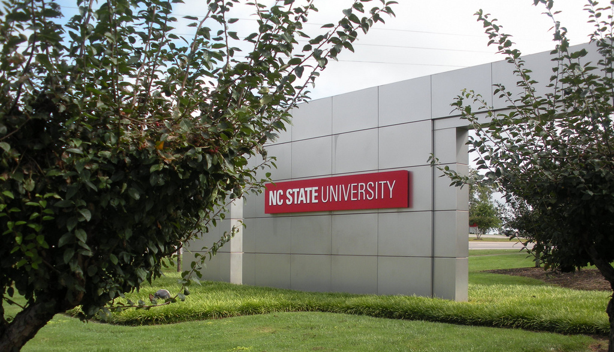

## Welcome

This website serves as Roy Hewitt's digital portfolio for GIS 520: Advanced Geospatial Analytics.  This course is part of the Master of GIS&amp;Technology track at N.C. State University.  The primary role of this site is to provide a listing of [completed course assignments]({{site.baseurl}}/assignments/).

*Sunset Over Earth* <a href="https://www.flickr.com/photos/nasamarshall/">by NASA's Marshall Space Flight Center</a> ISS, 11/23/09

## Course Description

This course covers the basics of Geographic Information Systems (GIS) analysis of real-life scenarios.  Analyses include data of both environmental, and man-made phenomena.  In the world of GIS data comes in both raster and vector formats.  This covers how to conduct analyses on both types of spatial data, and methods for converting between formats.

The assignments included in this course take the student through the entire process of conducting an analysis from collecting and normalizing data to producing professional quality maps and reflections.  As with any real-world analysis students are required to manipulate data to ensure the analyses are comparing like datasets.  This involves manipulating data types and formats in order to make apples-to-apples comparisons of spatial data.

As with any decision-making process there is almost always more than one way to approach the problem.  This course considers the strengths and weaknesses of different analytical techniques.  With this knowledge the student should be able to choose the most appropriate analysis method for a given problem.

*Geography* <a href="https://www.flickr.com/photos/awiseman/">by Andrew Wiseman</a>

## Course Reflection

Geographic Information Systems (GIS) and spatial analysis have a wide variety of applications through every sector of the economy and environment.  While the quote suggesting that [80 percent of all data contains some reference to geography](http://www.sensysmag.com/spatialsustain/reference-for-80-of-data-contains-geography-quote.html) is debatable, the fact that most important phenomena can often be described by a location attribute.  With GPS devices increasingly invading the pockets of people around the world data collection involving a specific geographic location is poised to see continued growth.

Rather than focusing on any one specific topic this course did a great job of showing the breadth of the field of GIS, which is a definite bonus.  I already work as a GIS analyst in the environmental field, but I could see how many of these analyses, data manipulation techniques could be applied to different arenas.

Data was often provided with the assignment, but for the assignment dealing with Census Bureau data students were required to search a government website to download a dataset of our choosing.  This is a great real-world experience as the user-experience on many government data portals is relatively poor.  I might suggest that more assignments require students to find and download the data required rather than providing it up-front.

One aspect that I would like to see change is the introduction of other software packages.  ArcGIS is the clear industry leader, but other, open source, technologies have closed the feature-gap over the last few years.  This is significant because, in my opinion, GIS analyses should be software agnostic.  To teach only one software package is to suggest it is the only (or best) tool for the job.  I think if one or two of the assignments were re-written to use [Quantum GIS (QGIS)](http://www.qgis.org/en/site/), an open-source alternative to ArcGIS, it would make students realize that the important thing to think about is spatial-problem solving rather than what buttons to push to conduct an analysis.  The other benefit of using open source technologies is that students can download the software cross-platform (Mac, Linux, Windows) and experiment at home without the need to pay licensing fees.

*NC State University* <a href="https://www.flickr.com/photos/23727257@N00/">by Suzie Tremmel</a>